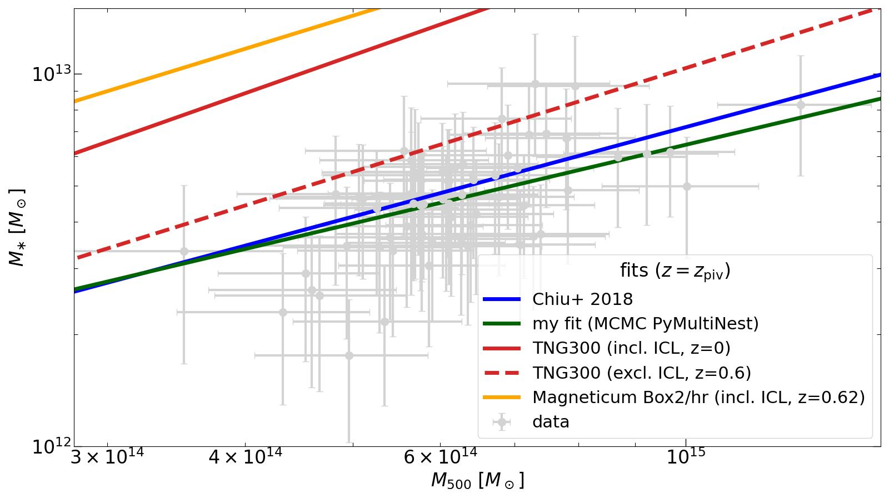

# Project Overview on my internship at USM (LMU Munich, 2024)

## Getting familiar with the topic and the data

To get an impression for the kind of data I will be working with, my first task was to update estimates for the stellar masses in several clusters. Chiu et al (2018) first computed stellar masses for ~90 clusters from SED fitting. However, this relies on correct halo masses (M500). These were updated since the paper release. That is why I'm computing new stellar masses with the updated halo masses.

For this, I'm using stellar mass profiles from Hennig et al (2017). Specifically,

$$ \cfrac{m_\ast^{new}}{m_\ast^{old}} = \cfrac{\int_0^{R_{500}^{new}} \rho_\ast r^2\rm{d}r}{\int_0^{R_{500}^{old}} \rho_\ast r^2\rm{d}r} $$

This means, the ratio of new and old stellar masses depend on the NFW stellar mass profiles. We use the parameters (concentration parameter c) for those from Hennig et al (2017).

$$ \rho = \cfrac{\rho_0}{\left(\cfrac{r}{R_S}\right)\left(1 + \cfrac{r}{R_S}\right)^2} $$

Since they used R200, we have to convert c to the c for R500. This is done for every halo separately: c500 = c200 * R500 / R200.

Since we don't know R200 but only R500, we have to compute the former. We use `scipy.optimize.root` on the following expression.

$$ \left(\cfrac{R_{200}}{R_{500}}\right)^3 \cdot \cfrac{\log\left(\cfrac{R_{200} + cR_{500}}{R_{200}} - \cfrac{cR_{500}}{R_{200} + cR_{500}}\right)}{\log(1+c) - \cfrac{c}{1+c}} - 2.5 = 0$$

Here we used the following [integral](https://en.wikipedia.org/wiki/Navarro%E2%80%93Frenk%E2%80%93White_profile#Density_distribution){:target="_blank"} for the enclosed mass within Rmax.

$$ M = 4 \pi\int_0^{R_{max}}\rho(r)r^2\rm{d}r = 4\pi\rho_0 R_s^3 \left[\log\left(\cfrac{R_s + R_{max}}{R_s}\right) - \cfrac{R_{max}}{R_s + R_{max}}\right] = 4\pi\rho_0 \left(\cfrac{R_{vir}}{c}\right)^3 \left[\log\left(1 + c\right) - \cfrac{c}{1+c}\right]
 $$

for Rmax = Rvir = cRs.

This gives us an estimate for R200 only from the (fixed) concentration parameter and R500. We can now compute c500 and thus find the desired ratio.

[//]: # (Comment test)

{:target="_blank"}

## Comparison to Simulations [^1]

In the following figure, I'm showing the total stellar mass as a function of their total cluster masses (yellow data points). For comparison, the best fit from the old stellar mass-halo mass relation from Chiu et al. (2018) is shown. As the masses did not change too much, the fit still describes the data quite well (by eye). Additionally, the stellar mass-halo mass relation from the IllustrisTNG300-1 simulation is shown. There is a significant offset to the data. One aspect, although not important enough to explain the deviation, is the intra-cluster light (ICL) which is included for the TNG300 curve, but not for the observational data (as there is currently no way to determine its contribution).

The next step is to fit the scaling relation

$$ M_\ast = A_\ast  \left(\cfrac{M_{500}}{M_{\rm piv}}\right)^{B_\ast}\left(\cfrac{1+z}{1+z_{\rm piv}}\right)^{C_\ast} $$

to my data. I used an MCMC python module named [PyMultiNest](https://johannesbuchner.github.io/PyMultiNest/index.html#){:target="_blank"} for this purpose. It evaluates different sets of parameters (A*,B*,C*) based on some priors using the Log-Likelihood.

The first step to finding the best parameters is to choose a set of parameters (A* ,B* ,C* ). Since we have some expectations on what the parameters will be, we can limit the range from which parameters are chosen. With these parameters and the M500 and z data, we can use the scaling relation to compute a prediction for M* . This prediction together with a scatter quantity are then used as mean µ and standard deviation of a lognormal distribution:

$$ P(x|\mu,\sigma) = \cfrac{1}{x\sigma \sqrt{2\pi}}\exp\left(\cfrac{(\ln{x} - \mu)^2}{2\sigma^2}\right) $$

We need a lognormal distribution here because M*  is normally distributed. However, since we're working with log(M* ), this quantity is lognormally distributed. We can now compute the value of the lognormal distribution for every data point and add them up. The result is the Log-Likelihood for this set of parameters. The goal is to maximize this quantity by varying the parameters within the range in a smart way (so it does not take too long). The results from my fit to the new stellar masses can be found (not yet) [here](./files/chain_no_measurement_error_1/_1_stats.dat). The second block of values gives the results of the best fit for the parameters in order and the standard deviation. The latter is computed by evaluating different sets of parameters that have similar Log-Likelihoods. The results are:

+ normalization: A*  = (3.85 +- 0.30) * 10^12 Msun
+ halo mass trend: B*  = 0.703 +- 0.207
+ redshift trend: C*  = 0.185 +- 0.516
+ scatter: D*  = 0.057 +- 0.044

[//]: # (Clarify this matter with Aditya!)

From this one receives the following plot where I set z to zpiv=0.6. For comparison, I also included fits with `scipy.optimize.curve_fit` and `scipy.optimize.odr.ODR` that both use least square approximation.

The next task is now to show the trend with halo mass and redshift separately. To exclude one or the other from the data, one simply divides by the respective term from the scaling relation with the best fit parameter:

$$ \left(\cfrac{M_{500}}{M_{\rm piv}}\right)^{B_\ast} \hspace{0.5cm}\text{or}\hspace{0.5cm}\left(\cfrac{1+z}{1+z_{\rm piv}}\right)^{C_\ast} $$

The fits are then altered by using Mpiv=4.8*10^14 Msun and zpiv=0.6 for M500 and z, respectively. This procedure yields the following plots.

[^1]: Note: From here on, instead of using the abovementioned procedure to compute R200, we directly take the M200 measurements and compute R200 directly from this. By doing so, we avoid numerical inaccuracies that could arise as M500 itself was not measured but calculated from the M200 measurements.