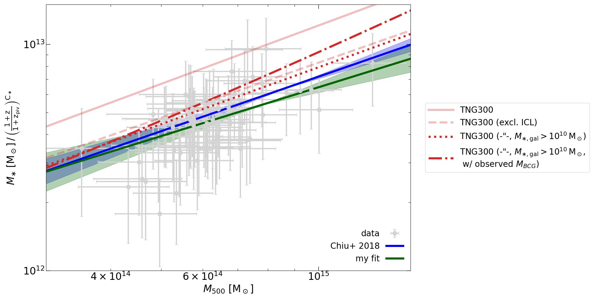
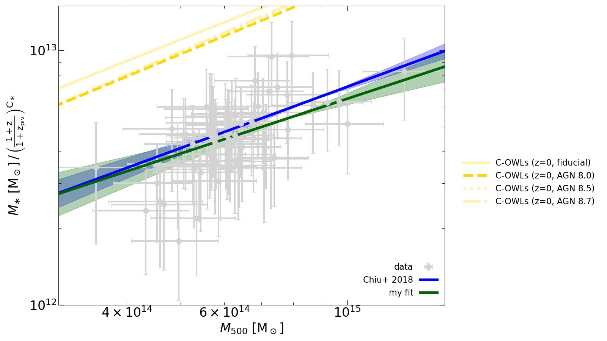

# Project Overview on my internship at USM (LMU Munich, 2024)

Note: As this also shows the progress I made during the internship, some plots in the beginning might be outdated. For now, I decided to keep them so I can see what improved over time. I might delete those figures at the end of the internship. Values like R500 always refer to the critical density, not the mean density, i.e. R500 = R500,crit, M200 = M200,crit etc.

## Getting familiar with the topic and the data

To get an impression for the kind of data I will be working with, my first task was to update estimates for the stellar masses in several clusters. [Chiu et al. (2018)](https://academic.oup.com/mnras/article/478/3/3072/4996803) first computed stellar masses for ~90 clusters from SED fitting. However, this relies on correct halo masses (M500). These were updated since the paper release. That is why I'm computing new stellar masses with the updated halo masses.

For this, I'm using stellar mass profiles from [Hennig et al. (2017)](https://academic.oup.com/mnras/article/467/4/4015/2939812). Specifically,

$$ \cfrac{m_\ast^{new}}{m_\ast^{old}} = \cfrac{\int_0^{R_{500}^{new}} \rho_\ast r^2\rm{d}r}{\int_0^{R_{500}^{old}} \rho_\ast r^2\rm{d}r} $$

This means, the ratio of new and old stellar masses depend on the NFW stellar mass profiles. We use the parameters (concentration parameter c) for those from [Hennig et al. (2017)](https://academic.oup.com/mnras/article/467/4/4015/2939812).

$$ \rho = \cfrac{\rho_0}{\left(\cfrac{r}{R_S}\right)\left(1 + \cfrac{r}{R_S}\right)^2} $$

Since they used R200, we have to convert c to the c for R500. This is done for every halo separately: c500 = c200 * R500 / R200.

Since we don't know R200 but only R500, we have to compute the former. We use `scipy.optimize.root` on the following expression.

$$ \left(\cfrac{R_{200}}{R_{500}}\right)^3 \cdot \cfrac{\log\left(\cfrac{R_{200} + cR_{500}}{R_{200}} - \cfrac{cR_{500}}{R_{200} + cR_{500}}\right)}{\log(1+c) - \cfrac{c}{1+c}} - 2.5 = 0$$

Here we used the following <a href="https://en.wikipedia.org/wiki/Navarro%E2%80%93Frenk%E2%80%93White_profile#Density_distribution" target="_blank">integral</a> for the enclosed mass within Rmax.

$$ M = 4 \pi\int_0^{R_{max}}\rho(r)r^2\rm{d}r = 4\pi\rho_0 R_s^3 \left[\log\left(\cfrac{R_s + R_{max}}{R_s}\right) - \cfrac{R_{max}}{R_s + R_{max}}\right] = 4\pi\rho_0 \left(\cfrac{R_{vir}}{c}\right)^3 \left[\log\left(1 + c\right) - \cfrac{c}{1+c}\right]
 $$

for Rmax = Rvir = cRs.

This gives us an estimate for R200 only from the (fixed) concentration parameter and R500. We can now compute c500 and thus find the desired ratio.

[//]: # (Comment test)

## Comparison to Simulations [^1]

In the following figure, I'm showing the total stellar mass as a function of their total cluster masses (yellow data points). For comparison, the best fit from the old stellar mass-halo mass relation from [Chiu et al. (2018)](https://academic.oup.com/mnras/article/478/3/3072/4996803) is shown. As the masses did not change too much, the fit still describes the data quite well (by eye). Additionally, the stellar mass-halo mass relation from the IllustrisTNG300-1 simulation is shown. There is a significant offset to the data. One aspect, although not important enough to explain the deviation, is the intra-cluster light (ICL) which is included for the TNG300 curve, but not for the observational data (as there is currently no way to determine its contribution).

The next step is to fit the scaling relation

$$ M_\ast = A_\ast  \left(\cfrac{M_{500}}{M_{\rm piv}}\right)^{B_\ast}\left(\cfrac{1+z}{1+z_{\rm piv}}\right)^{C_\ast} $$

to my data. I used an MCMC python module named <a href = "https://johannesbuchner.github.io/PyMultiNest/index.html#" target="_blank">PyMultiNest</a> for this purpose. It evaluates different sets of parameters (A* ,B* ,C* ) based on some priors using the Log-Likelihood.

The first step to finding the best parameters is to choose a set of parameters (A* ,B* ,C* ). Since we have some expectations on what the parameters will be, we can limit the range from which parameters are chosen. With these parameters and the M500 and z data, we can use the scaling relation to compute a prediction for M* . This prediction together with a scatter quantity are then used as mean µ and standard deviation of a lognormal distribution:

$$ P(x|\mu,\sigma) = \cfrac{1}{x\sigma \sqrt{2\pi}}\exp\left(\cfrac{(\ln{x} - \mu)^2}{2\sigma^2}\right) $$

We need a lognormal distribution here because M*  is normally distributed. However, since we're working with log(M* ), this quantity is lognormally distributed. We can now compute the value of the lognormal distribution for every data point and add them up. The result is the Log-Likelihood for this set of parameters. The goal is to maximize this quantity by varying the parameters within the range in a smart way (so it does not take too long). The results from my fit to the new stellar masses can be found (not yet) [here](./files/chain_no_measurement_error_1/_1_stats.dat). The second block of values gives the results of the best fit for the parameters in order and the standard deviation. The latter is computed by evaluating different sets of parameters that have similar Log-Likelihoods. The results are:

+ normalization: A*  = (4.48 +- 0.24) * 10^12 Msun
+ halo mass trend: B*  = 0.716 +- 0.207
+ redshift trend: C*  = 0.184 +- 0.499
+ scatter: D*  = 0.055 +- 0.042

The next task is now to show the trend with halo mass and redshift separately. To exclude one or the other from the data, one simply divides by the respective term from the scaling relation with the best fit parameter:

$$ \left(\cfrac{M_{500}}{M_{\rm piv}}\right)^{B_\ast} \hspace{0.5cm}\text{or}\hspace{0.5cm}\left(\cfrac{1+z}{1+z_{\rm piv}}\right)^{C_\ast} $$

The fits are then altered by using $M_{\rm piv}=6\cdot 10^{14}\, \rm M_{\odot}$ and $z_{\rm piv}=0.6$ for M500 and z, respectively. This procedure yields the following plots.

One can see reasonable agreement between the old (blue) and the new fit (green). Nevertheless, the slope of the mass trend is shallower as the halo masses increased. The redshift trend is not altered very much, it is still consistend with 0, e.g. no trend.

Another correction has to be taken into account, namely the different cosmologies applied in the simulations. In our data and [Chiu et al. (2018)](https://academic.oup.com/mnras/article/478/3/3072/4996803?login=false), a flat $\Lambda\text{CDM}$ cosmology is used with the following cosmological parameters (only the ones relevant for this analysis):

$$ \Omega_{\rm m} = 0.309, \hspace{0.5cm} \Omega_{\rm bar} = 0.048$$

Since the total amount of matter in the universe impacts the amount of stellar matter formed, we correct for the different baryonic matter densities by multiplying the stellar masses in each simulation with

$$f_{\rm corr} = \frac{f_{\rm bar}^{\rm data}}{f_{\rm bar}^{\rm sim}} \hspace{0.5cm}\text{where}\hspace{0.5cm} f_{\rm bar} = \frac{\Omega_{\rm bar}}{\Omega_{\rm m}}$$

Additionally, we subtract the ICL masses in the simulations (if provided) to receive a more accurate picture of the simulated stellar masses. In TNG300 and FLAMINGO, we choose an aperture of 50 pkpc, centered on the galactic center, to define the BCG. Every star particle outside of this region bound to the central subhalo is considered as ICL and treated accordingly. For Magneticum, the aperture is $2\, R_{0.5,\,\ast}$.

Thereby, we receive the following results for the best simulation variation runs.

One can still see significant deviations for BAHAMAS, C-OWLs and Magneticum. The former two are special because they still include the ICL, thus yielding higher stellar masses. The significant deviation for MAagneticum can be explained with the huge BCG masses ($\sim 10^{13}\,\rm M_{\odot}$) found. Altough they capture stars within twice the stellar halfmass radius, this is still an order of magnitude too large compared to observations and other simulations.

TNG300 and the fiducial FLAMINGO model perform best with only tiny deviations to the fits of the SPT clusters.

Another correction one can do is to subtract the simulated BCG stellar masses from the total stellar masses of the clusters. This step is necessary as e.g. in TNG, the BCG stellar masses are too high when compared to observations. For this reason, we fit the scaling relation to the reduced stellar masses and add the scaling relation fit of the observed BCG masses on top of it. We use the BCG masses summarized by [Stott et al. (2010)](https://iopscience.iop.org/article/10.1088/0004-637X/718/1/23#fnref-apj340771r41). Their halo masses are given within R200, so they are converted to M500 using the abovementioned methods. One obtains e.g. the dotted line in the TNG plot. The MCMC fitting routine yields the following for the normalization and power law index.

$$ M_{\rm norm} = (1.20\pm 0.33)\times 10^{12}\, \rm M_\odot \hspace{0.5cm}\text{and}\hspace{0.5cm} B_\ast = 0.44\pm 0.01 $$

However, for TNG this does not improve the fit anymore. One has to be careful with the apertures used for the BCG defiiton here and in [Stott et al. (2010)](https://iopscience.iop.org/article/10.1088/0004-637X/718/1/23#fnref-apj340771r41).

In the following, we will discuss the performance of each of the simulations individually and compare (if applicable) different variation runs.

### TNG300 [^2]

We can see in the mass trend plot that there is a deviation between all TNG300 lines. They were computed as the fit of the scaling relation to the set of individual halo data points. However, especially for larger halo masses (essentially above $\sim4\cdot 10^{14}\,\rm M_{\odot}$) this fit might not be accurate since there are no clusters that massive in TNG300. The dashed line captures all stellar mass in satellites (within R500) as well as an aperture of 50 pkpc centered on the BCG to exclude the extended ICL. This improves the fit significantly in comparison to the fit including all stellar matter within R500 (solid line), yet there still is a deviation to our data points. The next correction is to only add the stellar masses of galaxies above a certain threshold. I chose $10^{10}\,\rm M_{\odot}$ in stellar mass, as this is comparable to what [Chiu et al. (2018)](https://academic.oup.com/mnras/article/478/3/3072/4996803?login=false) did in their study. They integrated their stellar mass function with this value as the lower limit. This brings the line only marginally closer to our data points (dotted line). For comparison, we also show as the dashdotted line the entire BCG being removed and replaced by a mean BCG mass from an observational sample ([Stott et al. (2010)](https://iopscience.iop.org/article/10.1088/0004-637X/718/1/23#fnref-apj340771r41)). As one can see, this doe not really improve the fit, rather the mass slope increases. Nevertheless, by executing the abovementioned corrections, the TNG300 performance can be improved significantly.

IllustrisTNG is also based upon the Planck 2016 cosmological parameters: 

$$ \Omega_{\rm m} = 0.3089, \hspace{0.5cm} \Omega_{\rm bar} = 0.0486, \hspace{0.5cm} h = 0.6774 $$

### Magneticum [^3]

The provided data is from the Box 2b with side length of 640 MPc/h and $2\cdot 2880^3$ resolution elements ([Hirschmann et al. (2014)](https://academic.oup.com/mnras/article/442/3/2304/1039443), [Ragagnin et al. (2017)](https://academic.oup.com/mnras/article/486/3/4001/5475127)). As for TNG300, we show one line including (solid line) and one excluding the ICL (dotted line). In the plot above one cannot really distinguish the both. As discussed earlier, this may be due to the huge BCG masses found in Magneticum.

Nevertheless, both lines deviate strongly from our data points. Since there is no easy access to other variations of Magneticum, one cannot give a reason for this.

Magneticum is based upon the WMAP7 cosmology:

$$ \Omega_{\rm m} = 0.272, \hspace{0.5cm} \Omega_{\rm bar} = 0.0456, \hspace{0.5cm} h = 0.704 $$

### FLAMINGO [^4]

The FLAMINGO ([Schaye et al. (2023)](https://academic.oup.com/mnras/article/526/4/4978/7246074)) clusters have stellar masses closer to our data than Magneticum. In the plot above, we only show the variation lines once the ICL is removed. There are 8 variations of FLAMINGO differing in supernovae (SN) and active galactic nuclei (AGN) feedback. They are displayed in two different colors where the color is meaningless. It seems like there are two groups of simulations. The stronger SN (solid yellow), stronger AGN and stronger SN (dotted red), and the strong jets (solid purple) all show lower stellar masses than our data whereas the other variation runs show the opposite. However, the latter agree better with our data at lower masses while the former perform better at higher cluster masses.

This implies that stronger supernovae feedback stalls star formation whereas AGN feedback does not have that big of an impact.

What is good about the FLAMINGO simulations is that they possess clusters with masses above $10^{15} \rm{M}_\odot$. This is important as it matches our data better than TNG300 for example. Additionally, the fit of the scaling relation is more accurate at higher masses.

All of the eight FLAMINGO variations use the D3A cosmology with the following parameters:

$$ \Omega_{\rm m} = 0.306, \hspace{0.5cm} \Omega_{\rm bar} = 0.0486, \hspace{0.5cm} h = 0.681 $$

### BAHAMAS

All of the BAHAMAS ([McCarthy et al. (2016)](https://academic.oup.com/mnras/article/465/3/2936/2417021)) variations match our data worse than all of the FLAMINGO runs do. There is still a significant deviation. The best agreement is reached neither when increasing the AGN feedback strength by raising the AGN heating temperature nor by doing the opposite. In the two variations of the fiducial model of BAHAMAS, the heating temperatur of AGN is lowered (raised) by 0.2 dex. This means, that neighboring gas cells receive less (more) thermal energy, which decreases (increases) the AGN feedback strength. As visible in the plot, this has no strong impact on the stellar masses of galaxy clusters though. These lines show that the overestimation of stellar masses in the BAHAMAS simulations is not linked to an inaccurate feedback model but rather by including the ICL and low mass satellites.

The BAHAMAS simulations are based upon the WMAP9 cosmological parameters, namely:

$$ \Omega_{\rm m} = 0.279, \hspace{0.5cm} \Omega_{\rm bar} = 0.0463, \hspace{0.5cm} h = 0.700 $$

### C-OWLs

We have the reference run without AGN feedback (but _with_ SN feedback) and three models where the energy output of BHs is varied. In C-OWLs ([Le Brun et al. (2014)](https://academic.oup.com/mnras/article/441/2/1270/1064000)), the BH stores energy it gains from accreting mass until it reaches the threshold of heating up nheat=1 neighbouring gas cells by $\Delta T = 10^8 \rm K$. This is done in the AGN 8.0 model, in AGN 8.5 $\Delta T = 3\cdot 10^8 \rm K$ and in AGN 8.7 $\Delta T = 5\cdot 10^8 \rm K$. Since it takes longer to acquire the necessary amount of energy, the feedback is generally more bursty and energetic in case of higher $\Delta T$.

C-OWLs performs similarily to BAHAMAS, only that an increased feedback strength actually improves the fit.

Just as Magneticum, C-OWLs is based upon the WMAP7 cosmological parameters (see there).

### TNG-Clusters [^5]

### mTNG [^6]

## Redshift evolution

## Discussion

Now that we have seen the final (as of right now) [plot](https://github.com/wittigole/internship_usm/blob/main/plots/stellar_vs_halo_mass_wo_z_best_sims.jpg), some remarks have to be adressed and discussed.

1. For TNG300, we used mass-to-light ratios in the z-band to confirm that there are no huge deviations between the simulation and our clusters. We plotted the zband magnitude of a galaxy against its stellar mass and found agreement. Unfortunately, I had no access to z-band magnitudes of cluster galaxies for the other simulations either. The stellar masses are determined from the luminosities of mainly elliptical, red galaxies as they constitute most of the stellar mass of a cluster. If the simulations overestimate the luminosities in red bands, the stellar masses will alikely not agree with pur observational cluster sample.

2. For BAHAMAS and C-OWLs, it would be beneficial to also remove the ICL in order to accuratelyy evaluate their performance. Magneticum shows too massive BCGs, one would need to alter the aperture defining the BCG as well as the ICM.

3. Excluding low-mass satellites from the total stellar mass does not seem to have a big impact in TNG, thus it is probably also not too major for the other sims.

[^1]: Note: From here on, instead of using the abovementioned procedure to compute R200, we directly take the M200 measurements and compute R200 directly from this. By doing so, we avoid numerical inaccuracies that could arise as M500 itself was not measured but calculated from the M200 measurements.

[^2]: https://www.tng-project.org/

[^3]: http://www.magneticum.org/

[^4]: https://flamingo.strw.leidenuniv.nl/

[^5]: https://www.tng-project.org/cluster/

[^6]: https://www.mtng-project.org/